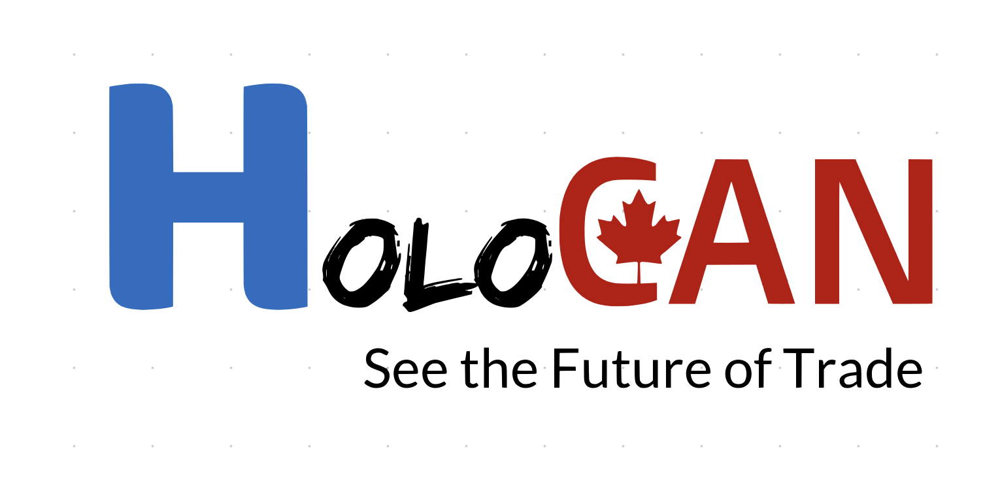

# HoloCAN - 中加虚拟贸易展示平台



HoloCAN是连接中国和加拿大中小企业的AI驱动虚拟贸易展示平台，旨在通过先进的人工智能和3D技术打破跨境贸易中的地域、语言和文化壁垒。

## 项目状态

本项目已完成所有核心功能开发并成功部署，包括：

- ✅ 跨境贸易主页及导航系统
- ✅ 中英双语切换功能
- ✅ AI智能匹配模块 
- ✅ 虚拟展览系统
- ✅ 合同法务支持页面
- ✅ 物流跟踪系统
- ✅ 跨境融资服务页面
- ✅ 客户端下载页面
- ✅ 移动端响应式适配
- ✅ 自定义域名配置
- ✅ DNS解析与CDN加速

## 核心优势

- **AI智能匹配**: 基于企业需求自动匹配最佳合作伙伴
- **3D虚拟展厅**: 突破地域限制的沉浸式产品展示体验
- **双语支持**: 内置中英双语界面和实时翻译
- **数据分析**: 提供市场趋势和商业洞察
- **全流程支持**: 从寻找合作伙伴到完成交易的全过程辅助

## 技术实现

HoloCAN平台基于以下技术栈开发：

- **前端**: Next.js + React + TailwindCSS
- **3D渲染**: Three.js / React Three Fiber
- **动画效果**: Framer Motion
- **部署环境**: Cloudflare Pages

## 目录结构

```
/
├── public/                # 静态资源文件
│   ├── holocanlogo.svg    # 品牌标识 (浅色版本)
│   ├── holocanlogo-dark.svg # 品牌标识 (深色版本)
│   ├── canada-162259.svg  # 加拿大国旗图标
│   ├── china-162389.svg   # 中国国旗图标
│   └── canda_photo*.png   # 加拿大商业场景图片集
│
├── src/                   # 源代码目录
│   ├── components/        # React组件
│   │   ├── layout/        # 布局组件
│   │   ├── exhibition/    # 展览相关组件
│   │   └── matching/      # 匹配系统组件
│   │
│   ├── context/           # React上下文
│   ├── pages/             # Next.js页面
│   ├── styles/            # CSS样式文件
│   └── types/             # TypeScript类型定义
│
├── .gitignore             # Git忽略文件
├── next.config.js         # Next.js配置
├── package.json           # 项目依赖
├── postcss.config.js      # PostCSS配置
├── tailwind.config.js     # Tailwind CSS配置
└── tsconfig.json          # TypeScript配置
```

## 快速开始

克隆并运行项目：

```bash
# 克隆仓库
git clone https://github.com/YangChengTS/holocan-demo.git

# 进入项目目录
cd holocan-demo

# 安装依赖
npm install

# 启动开发服务器
npm run dev
```

然后在浏览器中打开 [http://localhost:3000](http://localhost:3000) 查看项目。

## 部署状态

项目已成功部署并解决了所有路由访问问题：

- **官方网站**: [www.holocan.top](https://www.holocan.top)
- **备用地址**: [holocan-demo.pages.dev](https://holocan-demo.pages.dev)

所有页面均可通过导航栏访问，包括主页、展示、匹配、合同、物流、融资和下载页面。

## 后续计划

1. **功能扩展**: 增加更多AI驱动的智能匹配功能
2. **3D展厅优化**: 提升虚拟展厅的交互性和视觉效果
3. **移动端适配优化**: 进一步优化移动设备上的用户体验
4. **数据分析**: 集成更丰富的市场数据和商业见解
5. **性能优化**: 优化应用性能，提高加载速度

## 联系方式

如有任何问题或建议，请联系项目团队：

- **Email**: [contact@holocan.top](mailto:contact@holocan.top)
- **网站**: [www.holocan.top](https://www.holocan.top)
- **GitHub**: [YangChengTS/holocan-demo](https://github.com/YangChengTS/holocan-demo)

## 版权声明

© 2024 HoloCAN. 保留所有权利。

## 更新日志

### 2024-04-03 (最新版本)
- 修复了用户认证系统中的所有错误和类型问题
- 添加了缺失的`requestPasswordReset`方法到AuthContext
- 添加了缺失的`profileSchema`到类型定义中
- 修复了ProfileForm中的属性路径问题
- 修复了registerSchema中agreeToTerms验证问题
- 修复了UserRole、UserStatus、BusinessType和BusinessSize的类型问题
- 统一了认证路径系统，保留旧路径同时支持新路径(/login → /auth/login)
- 修复了next.config.js中的重定向规则
- 优化了静态构建过程，现在可以成功生成所有页面
- 解决了所有logo和静态资源404错误问题

### 2024-04-02
- 修复了用户界面中语言切换按钮的显示问题，现在英文环境显示"中文"，中文环境显示"English"
- 修复了企业用户无法访问企业信息表单的问题
- 修复了用户认证系统中的角色识别问题
- 更新了模拟登录功能，支持企业用户角色
- 清除了Next.js缓存问题，解决了重复导入错误
- 优化了用户体验，使切换语言更加直观

### 2024-04-01
- 完整重构项目结构，成功解决了路由访问问题
- 优化仓库分支管理，清理多余分支，统一使用main分支
- 修复了融资页面和下载页面的404错误问题
- 移除了重复的页面文件，避免静态生成冲突
- 更新Cloudflare Pages构建配置，确保正确部署
- 优化了构建输出目录结构，确保静态资源正确加载

### 2024-03-31
- 添加项目结构和Cloudflare部署配置说明文档
- 识别并解决了导致页面访问问题的根本原因 